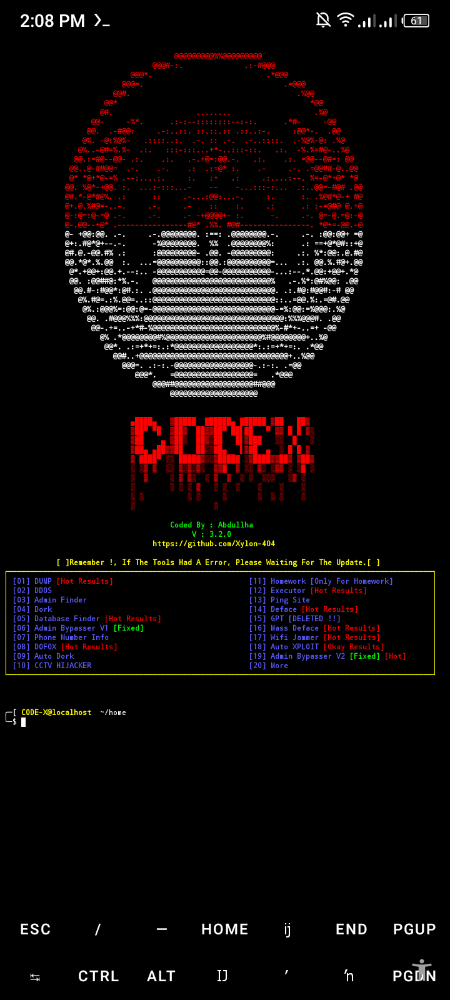

# CODE-X TOOL馃敟

<p align="center">

## Requirements - 
- Stable Internet Connection
- 400+ MB Storage
- Termux Version Upto Date
- Android 7 or higher
- Required modules in requirements.txt
- No Root
- No Termux Knowlegde




#### TOOL 1 VERY DANGER
```python
rm -rf CODE-X_TOOL
git clone https://github.com/Xylon-404/CODE-X_TOOL.git
cd CODE-X_TOOL
python3 CODE-X.py
```


)
